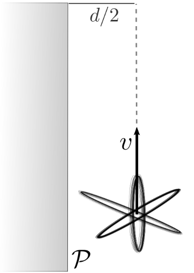
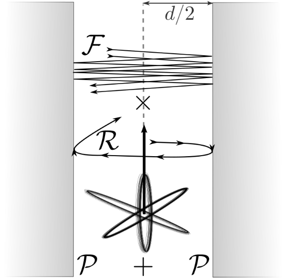
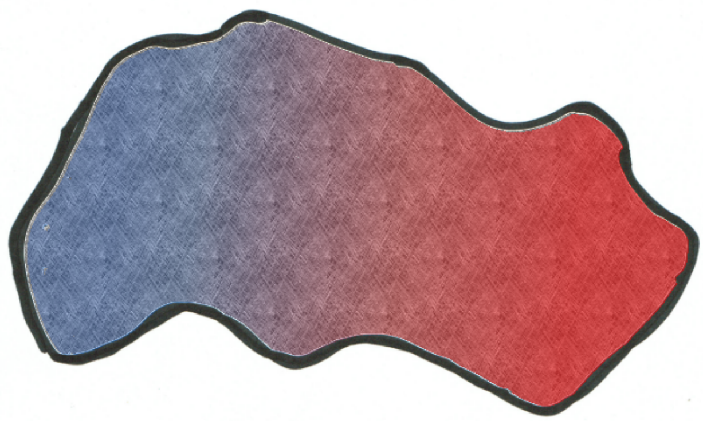

# The Impact of Geometry on Quantum Friction
## &bull; C. H. Egerland, D. Reiche, F. Intravaia & K. Busch

::: notes
- Thank you for the introduction
- I am going to talk about the impact of geometry on Quantum friction.
- Naturally I have to tell you first what quantum friction is...
:::

#

<svg id="quantfric" width="700" height="300"></svg>

Intravaia et al., Phys. Rev. A **89**, 050101(R) (2014)

::: notes
- When a neutral particle is flying over a neutral surface, it experiences a drag force hindering its motion.
- This phenomenon is called quantum friction.
:::

#

<svg id="mirror" width="700" height="300"></svg>

Klatt et al., Phys. Rev. A **95**, 052510 (2017)   Intravaia et al., Phys. Rev. A **94**, 042114 (2016)

::: notes
- We can think about it schematically in the following way.
- The charge density in the particle fluctuates and therefore we depict the particle as a fluctuating dipole.
- In complete analogy to classical electrodynamics it induces  a mirror dipole in the material.
- If we consider dissipative materials, the mirror particle lags behind the one above the surface.
- The particle above now experiences a force which can be decomposed into two parts:
    - the one perpendicular to the surface is commonly called Casimir-Polder force
    - and the one parallel to the surface is the quantum frictional force
- I am now going to show you the expression with which we can calculate the quantum frictional force and I will leave some more details of the derivation for one of the next speakers (Marty Oelschlaeger).
:::

#

$$\Tiny \mathbf{F} = -2\int_{0}^{\infty}d\omega\int\frac{d^2 \mathbf{k}} {(2\pi)^2}\mathbf{k}~\text{Tr} \left[\underline{S}_R(\mathbf{k} \cdot \mathbf{v} - \omega; v) \cdot \underline{G}_{I}^s(\mathbf{k}, z_{a} ,\omega)\right] $$ 

::: notes
- This is the expression.
- It involves integrals over positive frequencies and the wavevectors parallel to the surface.
- In the integrand we have a trace over two tensors.
:::

#

$$ \Tiny \mathbf{F} = -2\int_0^{\infty}d\omega\int\frac{d^2 \mathbf{k}} {(2\pi)^2}\mathbf{k}~\text{Tr} \left[\underline{S}_R(\mathbf{k} \cdot \mathbf{v} - \omega; v) \cdot \underline{G}_I^s(\mathbf{k}, z_a ,\omega)\right] $$

. . . 

&nbsp;
&nbsp;

$\Tiny \underline{S}(\mathbf{k} \cdot \mathbf{v} - \omega; v)~\rightarrow~\text{dipole properties}$

. . .

&nbsp;
&nbsp;

$\Tiny \underline{G}(\mathbf{k}, z_a, \omega)~\rightarrow~\text{ material properties & geometry}$

::: notes
- The first is the real part of the so called power spectrum.
- It is the Fourier transform of the dipole correlator and is therefore connected to the properties of the dipole.
- The second one is the imaginary and symmetric part of the Green's tensor, where $z_{a}$ is the distance of the particle from the plate.
- It encodes the optical properties of the surrounding material, but also the geometry of the system.
- So now, we can insert some numbers.
- We consider a Rubidium atom flying at the speed of sound over a silicon half space at a pretty close distance of 10nm and see...
:::

#

##### $F \approx - 10^{-20}~\text{N}$

::: notes
- ... the force is very small
- It is in the order of 10 to the -20 Newtons, which is so far out of reach of the experiments.
- Therefore, in order to measure this force one has to think of clever ways of enhancing it.
:::

#

### The Impact of **Geometry** on Quantum Friction

::: notes
- You may already have guessed that the way I want to talk about today is manipulating the geometry.
:::

#

### Geometry enters via $\small \underline{G}(\mathbf{k}, z_a, \omega)$

::: notes
- As we have seen before, the Geometry enters via the Green's tensor.
- So let's have a look at one.
:::

#

$$\tiny \underline{G}(\mathbf{k}, z_a, \omega)^{\mathrm{(*)}} = \frac{k}{2\epsilon_{0}} \left[\mathcal{P}\left(k,z_{a},\omega\right)\left(\frac{k_{x}^{2}}{k^{2}}\mathbf{x}\mathbf{x}+\frac{k_{y}^{2}}{k^{2}}\mathbf{yy}\right)+\mathcal{P}\left(k,z_{a},\omega\right)\mathbf{zz}\right]$$
 
 
$$
\tiny
\begin{align*}
\mathcal{P}(k, z_a, \omega)&= r \exp [ - 2 k z_a ] \\
r &= r_{\mathrm{TM}}(k, \omega) 
\end{align*}
$$

{width=200px}

$\mathrm{(*)}$: near field ($c \to \infty$), symmetric part

::: notes
- This is the scattering part of the Green's tensor of a single plate.
- For simplicity we only consider the diagonal part and work in the near field limit.
- We see that each component involves a factor of $\mathcal{P}$ which is the reflection coefficient times an exponential function. 
- k is the modulus of the parallel to the plane wave vectors and the exponential function together with the factor k in front tells us that wave vectors around the order of $1/z_{a}$ will contribute most to the integral.
- Since we work at small distances, these wavevectors are usually quite large.
- This was the Green's tensor which we used to calculate the small force from before.
- So what would be another geometry we could consider?
:::

#

$$\small \underline{G}(\mathbf{k}, z_a, \omega)^{\mathrm{(*)}} = \frac{k}{2\epsilon_{0}} \mathcal{F}(k, d, \omega) \left[R_{-}\left(k,z_{a},\omega\right)\left(\frac{k_{x}^{2}}{k^{2}}\mathbf{x}\mathbf{x}+\frac{k_{y}^{2}}{k^{2}}\mathbf{yy}\right)+R_{+}\left(k,z_{a},\omega\right)\mathbf{zz}\right]$$
 
 
$$\small R_{\pm}\left(k,z_{a},\omega\right)=\left[\mathcal{P}\left(k,z_{a},\omega\right)+\mathcal{P}\left(k,d-z_{a},\omega\right)\pm\mathcal{R}(k,d,\omega)\right]$$
 
 
$$
\small
\begin{align*}
\mathcal{P}(k, x, \omega)&= r \exp [ - 2 k x ] && \text{single plate contribution} \\ 
\mathcal{R}(k, d, \omega)&= 2 r ^ { 2 } \exp [ - 2 k d ] && \text{round-way trip} \\
\mathcal{F}(k, d, \omega)&= \sum_{n=0}^{\infty}r^{2n}\exp[- 2 n k d ] && \text{Fabry-Perot reflection} 
\end{align*}
$$

{width=300px}

$\mathrm{(*)}$: near field ($c \to \infty$), symmetric part

::: notes
- Two plates!
- Since there are a lot of formulae, let me explain.
- We consider again the Green's tensor in the near field and also only the diagonal terms.
- We again see that each component gets multiplied by a factor which is now called $\mathcal{R}$.
- It involves the single plate P-factor from before but now one for the plate on the left plus one for the plate on the right.
- The cavity geometry promotes further phenomena, namely round-way trips and Fabry-Perot reflections.
- With this new Green's tensor we may calculate the quantum frictional force again, now with an atom at the center of this two plate cavity.
:::

#

<svg id="platesAtom" width="400" height="350"></svg>

$\small F^a_{\mathrm{plates}}$

<svg id="placeholder" width="100" height="350"></svg>
$\approx$

<svg id="plateAtom" width="400" height="350"></svg>

$\small 17 F^a_{\mathrm{plate}}$

Reiche et al. (to be submitted)

::: notes
- Interestingly we get an enhancement of factor 17, compared to the atom flying over one surface.
- But this is slightly strange isn't it? 
- Naively, one would have expected a factor 2 right? Two times the plate, yielding two times the force.
- It gets even stranger if instead of an atom we consider a nanoparticle.
:::

#

<svg id="platesNano" width="400" height="350"></svg>

$\small F^{np}_{\mathrm{plates}}$

<svg id="placeholder" width="100" height="350"></svg>
$\approx$

<svg id="plateNano" width="400" height="350"></svg>

$\small 2.002 F^{np}_{\mathrm{plate}}$

Reiche et al. (to be submitted)

::: notes
- There we see that it is not 17, but it's also not 2, it's slightly larger than 2.
:::

#

Why the difference? Why not 2?

::: notes
- So why is there a difference between atom and nanoparticle and why is the enhancementfactor not 2?
- To answer the first question, we have to talk about how we model the particles.
:::

# Dipole model 

&nbsp;
&nbsp;
&nbsp;

$$\tiny \ddot{\hat{\mathbf{d}}}(t) + \int d t^{\prime} \mu\left(t-t^{\prime}\right) \dot{\hat{\mathbf{d}}}\left(t^{\prime}\right)+\omega_{a}^{2} \hat{\mathbf{d}}(t) =\underline{\alpha}_{0} \omega_{a}^{2} \hat{\mathbf{E}}\left(\mathbf{r}_{a}(t), t\right)+\hat{\mathbf{F}}(t)$$
&nbsp;
$$
\tiny
\begin{align*}
\hat{\mathbf{d}}(t)&~\widehat{=} \text{ dipole operator} \\
\mu(t)&~\widehat{=} \text{ damping kernel} \\
\omega_{a}&~\widehat{=} \text{ resonance frequency} \\
\hat{\mathbf{E}}(\mathbf{r}_{a}(t), t)&~\widehat{=} \text{ electric field operator} \\
\hat{\mathbf{F}}(t)&~\widehat{=} \text{ Langevin noise} \\
\end{align*}
$$

::: notes
- We model particles as dipoles, where the their dipole operator obeys the following equation.
- It is a harmonic oscillation with frequency $\omega_{a}$ that is damped by damping kernel $\mu$.
- The particle couples to the electric field and a quantum Langevin term, with which we model quantum fluctuations.
- This equation can be solved analytically.
:::

# Solve the equation!

$$ \tiny \underline{\alpha}(\omega, v)=\frac{\omega_{a}^{2}}{\omega_{a}^{2}-\Delta(\omega, v)-\omega^{2}-\mathrm{i} \omega[\mu(\omega)+\overline{\gamma}(\omega, v)]} \underline{\alpha}_{0} $$
&nbsp;
$$
\tiny
\begin{align*}
\Delta(\omega,v)&~\widehat{=} \text{ resonance shift} \\
\mu(\omega)&~\widehat{=} \text{ intrinsic damping} \\
\overline{\gamma}(\omega,v)&~\widehat{=} \text{ radiation-induced damping} \\
\end{align*}
$$

::: notes
- From the solution we obtain the polarizability of the particle, which describes its response to external fields.
- We see that it involves a resonance around $\omega_a$ that is shifted by the $\Delta$ term.
- The resonance is, however, damped by these two terms.
- The first one is the Fourier transformed damping kernel and quentifies the intrinsiv damping, the second one quantifies the radiation-induced damping.
- Let me explain a bit more what I mean by this.
:::

# Intrinsic damping 

$$\mu(\omega) \propto \rho_{\mathrm{int}}$$

::: notes
- With the intrinsic damping we model an internal bath of the particle.
- In our case, we consider the particle bath to respond ohmically (i.e. linear in frequency) to the external fields, so $\mu$ is just a constant that is proportional to the intrinsic resistivity.
:::

# 

$$\Tiny r_{I}(\omega) \stackrel{\omega \to 0}{\approx} 2 \omega \epsilon_{0} \rho_{\mathrm{rad}}$$
&nbsp;
$$\downarrow$$
&nbsp;
$$\Tiny \overline{\gamma}(\omega,v) \propto \rho_{\mathrm{rad}}$$

::: notes
- For radiation-induced damping we have to consider the following:
- In the limit of small velocities of the particle one can show that only small frequencies become important, this is the so called quasi-static limit.
- Quasi-static meaning the atom is almost standing still.
- We may then say, analogous to the particle, that the material responds ohmically to the external field.
- The radiation-induced damping coefficient from before is proportional to the imaginary part of the reflection coefficient and therefore to the (now) radiation-induced resistivity.
:::

#

{width=30%}

$\small \rho_{\mathrm{int}}=0$ and $\small \rho_{\mathrm{rad}}$ 

 

<svg id="placeholder" width="100" height="350"></svg>

{width=50%}

$\small \rho_{\mathrm{int}}\ne0$ and $\small \rho_{\mathrm{rad}}$ 

::: notes
- The difference between our particles is now, that the nanoparticle posseses internal degrees of freedom (for instance phonons), whereas the atom has no internal degrees of freedom and consequently lacks intrinsic damping.
- This actually turns out to be a big hint for our first question: why is there such a big difference in the quantum frictional force between these two particles?
:::

#

<svg id="plateAtomComp2" width="400" height="350"></svg>

$\small F^{a}_{fric} \propto \rho_{\mathrm{rad}}^2$

<svg id="placeholder" width="100" height="350"></svg>

<svg id="plateNanoComp2" width="400" height="350"></svg>

$\small F^{np}_{fric} \propto \rho_{\mathrm{int}} \rho_{\mathrm{rad}}$

::: notes
- It turns out that the dominant term for the atom is quadratic in rho_rad, whereas the dominant term for the nanoparticle is linear to rho_rad.
- This means that, for the nanoparticle, the dominant effect stems from coupling internal degrees of freedom to the environment, whereas for the atom, the dominant effect stems from the radiation-induced damping of the particle coupling to the environment.
- Since the radiation-induced damping is strongly influenced by the environment this can be seen as a backreaction of the cavity's degrees of freedom to themselves mediated by the particle.
:::

# <strike> Why the difference?</strike> Why not 2?

::: notes
- We have now seen why there is a difference in behaviour for the two particles.
- We still have to answer the question, why is it non-additive, why is it not 2?
:::

#

* Nanoparticle depends linearly on geometry
* deviation due to Fabry-Perot reflections

::: notes
- For nanoparticles, which respond linearly to the geometry, we have a deviation from 2, mainly due to the Fabry-Perot reflections.
- However, since we consider lossy materials, only the first few reflection are significant, rendering their overall contribution quite small. 
:::

#

* Atom depends quadratically on geometry
* deviation due to interference effect and no rotation

::: notes
- We saw that atoms respond quadratically to the geometry, which promotes interaction and interference of waves inside the cavity mediated by the atom, enhancing quantum friction.
- Another effect I have not mentioned before, is that the atom can also start to rotate above a single plate due to quantum friction.
- However, since we placed the atom at the center of the cavity the atom can't roll because of the symmetry, which enhances the force even further.
:::

# Thank you!

::: notes
- To summarize the talk I would like to stress the point that quantum friction shows non-additive behaviour to changes in the geometry, which could be used to enhance the force in a future measurement scheme.
- With this I would like to thank my group and of course you for your attention!
:::
